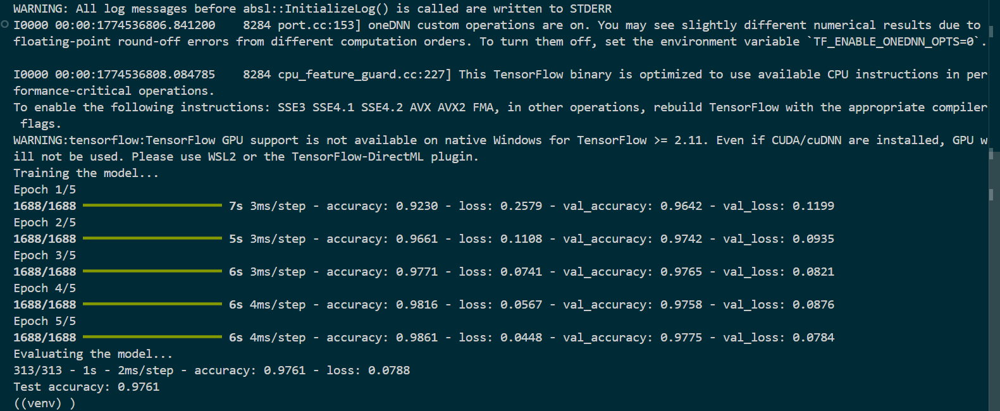

# MNIST Dataset from Keras to building a Feedforward Neural Network.

## Overview
This project demonstrates loading the MNIST dataset using Keras and training a feedforward neural network for digit classification.

## Installation
- To install the main libraries plus dependancies, which are listed in `requirements.txt`
```bash
pip install tensorflow keras numpy
```
## Model Training
The model is a simple Feed Forward Neural Network with 2 hidden layers that use `ReLu` as their activation functions.<br>
As well as Input - that takes the image array - and output layer that uses a `Softmax` activation function to classify the image in ranges (0-9).

## Model Accuracy

**Training Accuracy:** `97.6% train accuracy` and a `0.0788 loss` <br>



**Test Accuracy:** `0.9761 -> 97.6%`

- *Note that:* Exact Training and Test scores differ on each execution cycle.