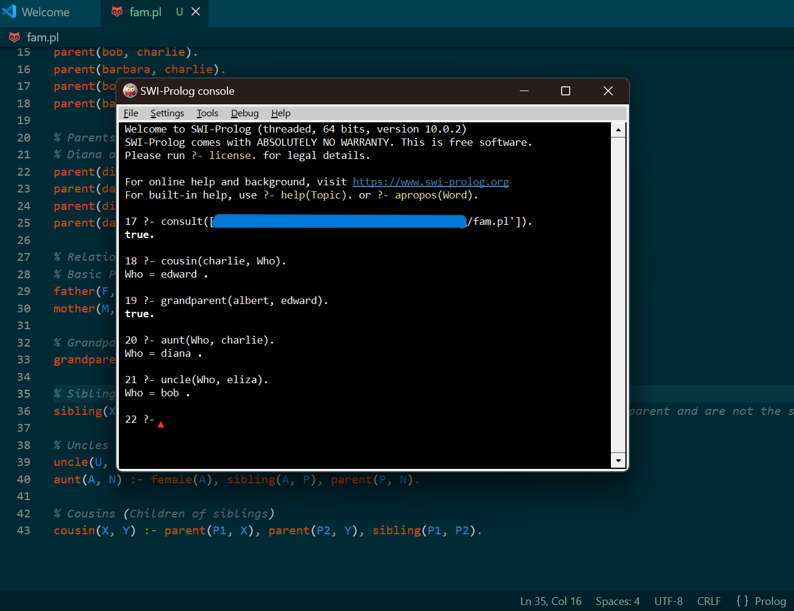

# 🦝 Prolog Practice
This repo features a prolog "source file",  and an image of the   
Prolog console "consulted" on it.

## Source file Content
The file defines a family tree for Grandparents, parent and grandchildren.
- Grandparents - Albert and Alice.
- Parents - Bob and Barbara, David and Diana.
- Grandkids - Charlie, Claire, Edward, and Eliza.

The file also define some additional rules for the relationships between Family members such as: 
- Grandparents.
- Uncles and Aunts.
- Cousins

## Prolog demo

I asked about:
- Charlie's Cousin.
- If Albert is Edward's grandparent.
- Who is Eliza's uncle.

# 📔Author
Anthony Mndenyi - Sophomore, MMU.