# 🔍 Searching Algorithms and a Vacuum Agent(Simple Reflex agent)
- This folder consists of 3 separate...folders😅:
1. A* Search algorithm - was to answer an assessment question.
2. Vacuum Cleaner Agent algorithm - Also answers a question under that same assessment.
3. Bfs and Dfs algorithms - Code that implements the 2 search algorithms.
    - This was for Tasks 4 for the school assignments.

## 1.A* Search - `A_search`
- This code was used to answer question one (b) of CAT1, where a A* search algorithm is used.
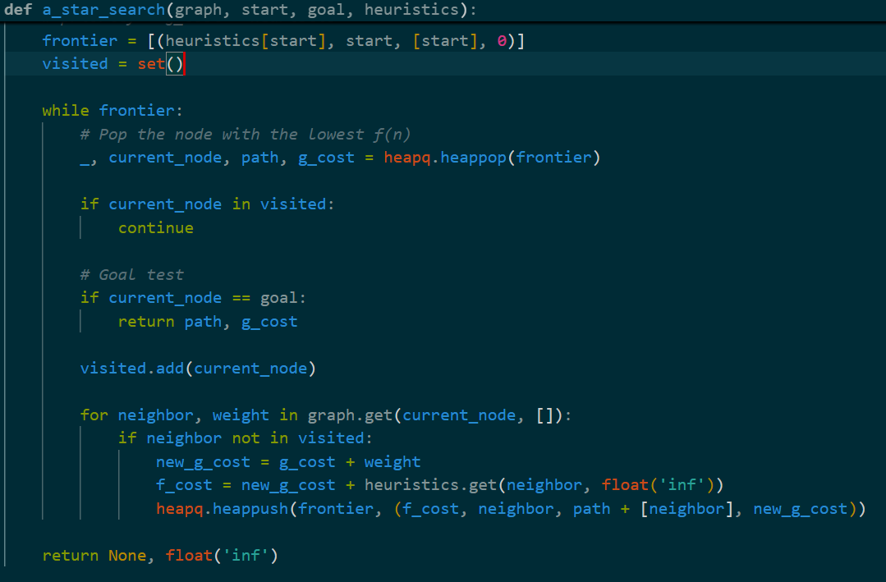
- Implements the A* search algorithm to find the optimal path between two nodes. It uses a priority queue ordered by `f(n) = g(n) + h(n)`, where `g(n)` is the actual cost from start to current node and `h(n)` is the heuristic estimate to goal.
- The data used:
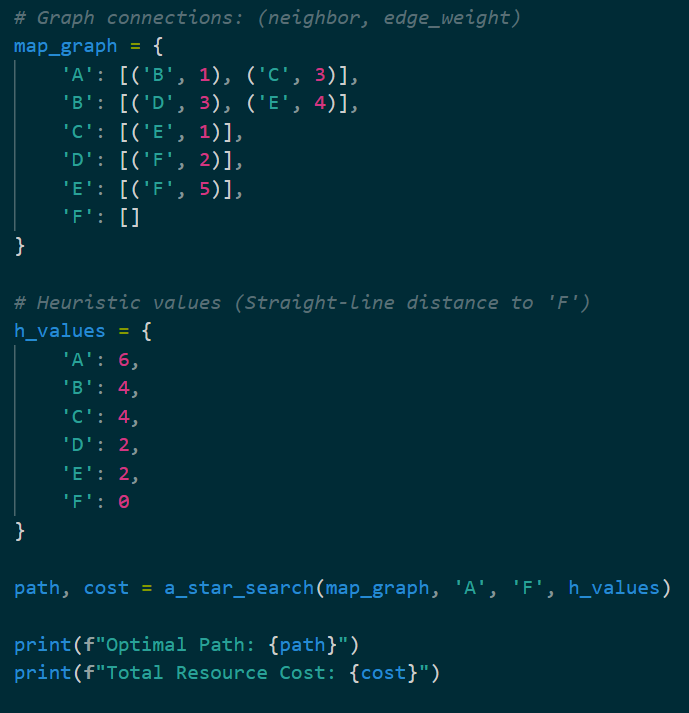
- Output:
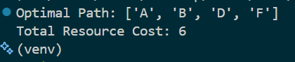 
- Returns the optimal path and its total cost, or `None` if no path exists.

## 2. Vacuum Cleaner Agent -`Vacuum_agent`
- This code was used to answer question two (b) of CAT1.
- A simple reflex agent that cleans dirty locations in an environment. It takes an environment layout (dictionary of locations and their cleanliness status).
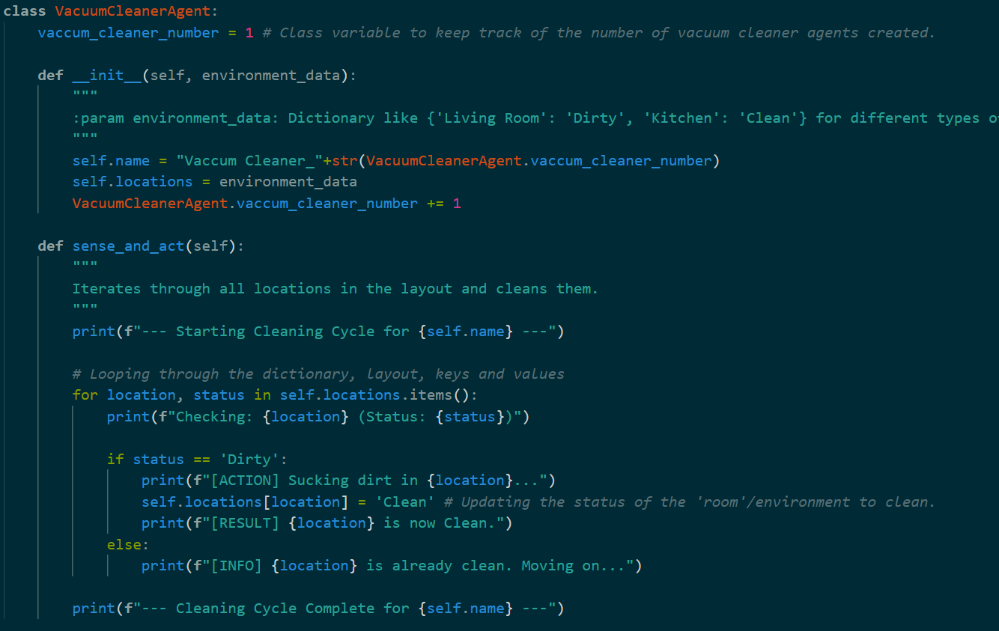
- It then uses the `sense_and_act()` method to iterate through all locations, detecting dirty areas and cleaning them.
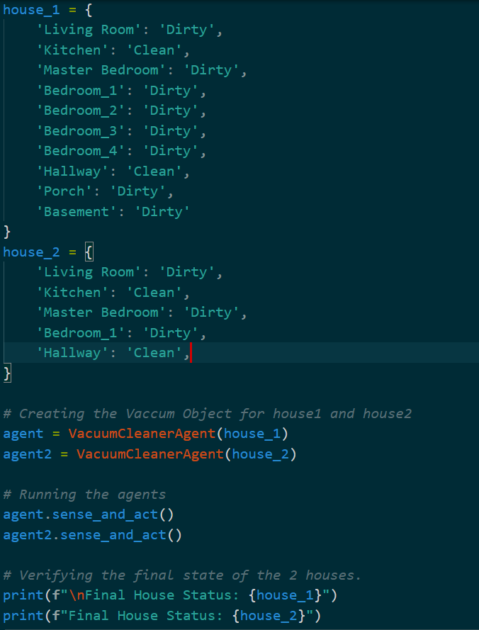
- Each agent instance is automatically numbered via a class variable.
- Output: 
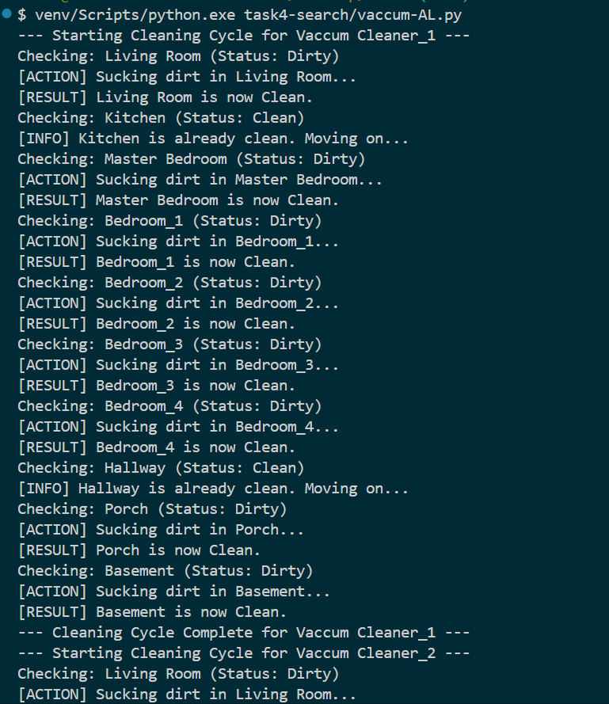
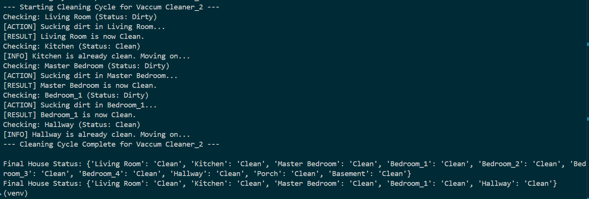
- Feedback from both agents and status of the houses' rooms.

## 3. Bfs and Dfs algorithms, Task 4 - `bfs_dfs`
### Breadth First Search
- The breadth first search algorithm uses a double ended queue(`deque`) from the `collections` python inbuilt module.
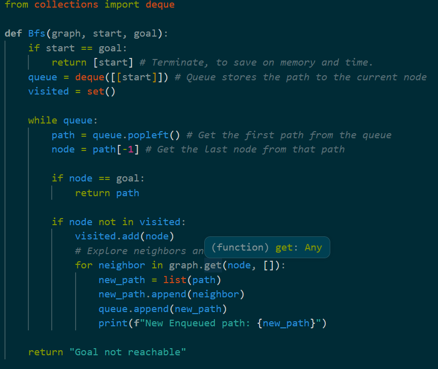
- The queue keeps track of the last and first path entered.
- It contructs new paths for nodes not visited and append them to the `deque`.
### Depth First Search
- The Depth First Search algorithm uses a stack to keep track of the last path entered which focuses on one branch and its neighbours until the last node on that branch doesn't have any neighbours.
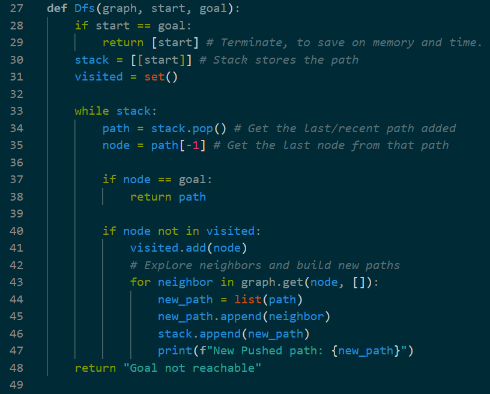
- It contructs new paths for unvisited nodes which in turn can shift path focus of the algorithm through the stack.
### Data used
- The algorithms were tested on a common simple and complex graph.
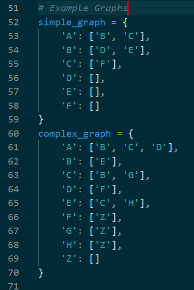
### Output
- The whole ouput and feedback:
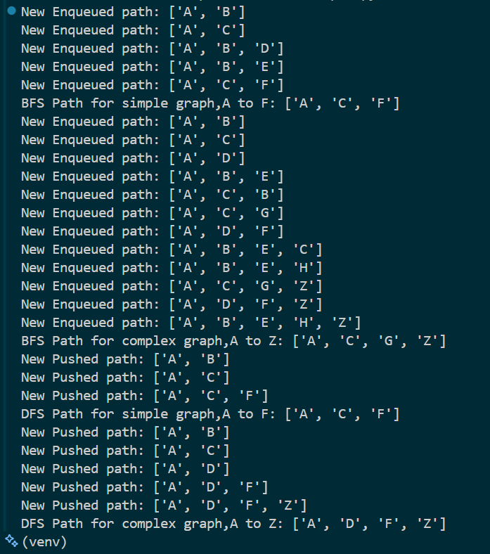

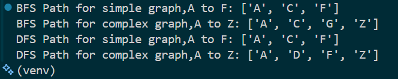
- Clear path outputs.